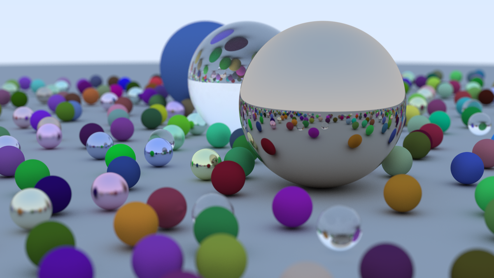

# Ray Tracing in One Weekend

A Rust implementation of the raytracer from [Ray Tracing in One Weekend
 by Peter Shirley](https://raytracing.github.io/books/RayTracingInOneWeekend.html).

## Example output (1000 samples per pixel):

